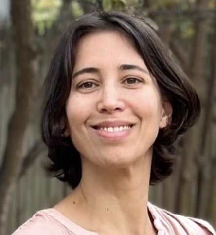
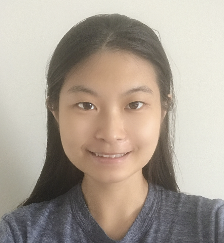
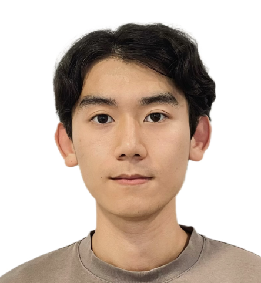
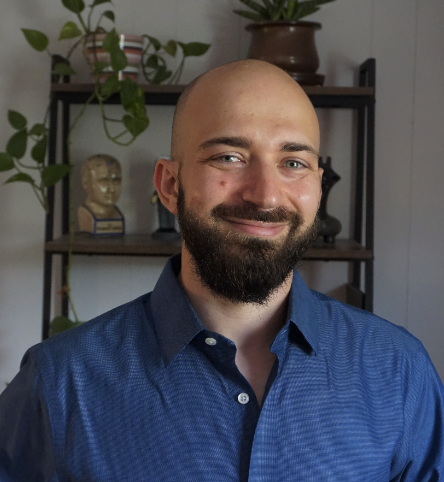

# Our Team

Welcome to the team page! Meet the amazing people who make our project successful.

---

## Team Members

### Catie Chang, PhD
Assistant Professor  
Vanderbilt University

**Role:** Principal Investigator 
**Contact:** catie [dot] chang [at] vanderbilt [dot] edu

---

### Roza Gunes Bayrak, PhD
Research Assistant Professor 
Vanderbilt University

**Role:** Co-Investigator 
**Contact:** roza [dot] g [dot] bayrak [at] vanderbilt [dot] edu

---

### Shiyu Wang
PhD Candidate

---

### Ziyuan Xu
Undergraduate Student

---

### Ben Gold
Post-doc