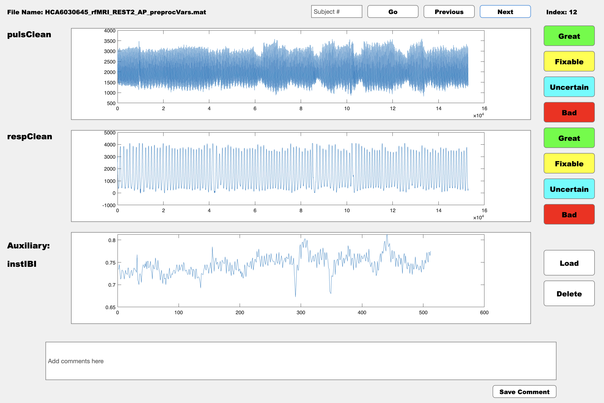

---
hide:
  - toc
---

## Manual Annotation of Physiological Data Using MATLAB GUI

This guide will help you utilize the QA_app, a tool for visualizing and manually assessing the quality of physiological data in MATLAB. By following these instructions, you'll be able to label data quality, add comments, and generate a summary CSV file with your annotations.

<h3>Step 1: Download the MATLAB Application</h3>

**Download the application files**:

**Clone the GitHub repository** containing the application. If you have Git installed, open your terminal or command prompt and run:
```bash
git clone https://github.com/neurdylab/physio_QA_manual.git
```
Alternatively, **download the ZIP file** from the GitHub page and extract it to your desired location.

<h3>Step 2: Prepare Your Data</h3>

**Access example data files**:

- The repository includes a `Data` folder with four example `.mat` files. Each file represents a different subject with various physiological measures.

**Example folder structure**:
```
/physio_QA_manual
    /Data
        subject1.mat
        subject2.mat
        example1.mat
        example2.mat
        ...
```

<h3>Step 3: Launch the Application</h3>

- **Open MATLAB** and set your current directory to the root of the `physio_QA_manual` folder.
- **Execute the `QA_App_v101.m` script** by typing the script's name in the Command Window and pressing Enter. This will open the Quality Assessment GUI.

<h3>Step 4: Using the App</h3>

**Load Data**:

- Click on the `Load` button to populate the interface with fields from your `.mat` files.
- Enter the name of a physiological measure to display its data.

!!! note 
    You can load two physiological variables to QA simultaneously and an auxiliary waveform to aid your decision making process. 
   
**View and Assess Data**:

- Use the `Previous` and `Next` buttons to browse through different subjects.
- Rate each data segment's quality using categories like `Great`, `Good`, `Fixable`, or `Bad`.
   
**Add Comments**:
   
- Provide comments in the provided text box, especially if you mark data as `Fixable`. This helps in later reviews or corrections.

<figure markdown="span">
  { width="600" }
  <figcaption>Preview of the manual annotation tool.</figcaption>
</figure>

<h3>Step 5: Save and Review Results</h3>

**Check and save your assessment results**:

- The app automatically saves your ratings and comments into a CSV file named based on your inputs during the initial setup.
- This file is stored in the root directory of the repository and can be referred to as `result.csv` or another name you provided.

!!! Warning "Important Notes"

    - You can close and reopen the app at any time; your assessments are saved continuously. **Do NOT** modify the structure of the CSV file or the Data folder after starting your assessments to avoid inconsistencies or data loss.

---

For further assistance or troubleshooting, feel free to open an [issue](https://github.com/neurdylab/physio_QA_manual/issues) on or github repo.

---

## Simple Automated Quality Assessment for Cardiac Data

<h3>Step 1: Setting Up Your Environment</h3>
Before diving into the code, ensure your Python environment is properly set up to handle the required tasks. You will need specific libraries to run the provided code. Here's how to set them up:

**Create a virtual environment** (optional but recommended):
   ```bash
   python -m venv myenv
   source myenv/bin/activate  # On Windows use `myenv\Scripts\activate`
   ```

**Create a `requirements.txt` file with the following content**:
   ```
   numpy
   matplotlib
   scipy
   tensorflow
   scikit-learn
   pickle-mixin
   requests
   ```
**Install them using pip**:
   ```bash
   pip install -r requirements.txt
   ```

<h3>Step 2: Import Necessary Libraries</h3>
Open your Python script or notebook and import the necessary modules:

```python
import numpy as np
import pickle
import matplotlib.pyplot as plt
from scipy.signal import find_peaks
from scipy.stats import mode
import tensorflow as tf
from tensorflow.keras.models import Sequential
from tensorflow.keras.callbacks import EarlyStopping
from tensorflow.keras import layers
from sklearn.model_selection import train_test_split, KFold
from sklearn.preprocessing import StandardScaler
```

<h3>Step 3: Load and Prepare the Data</h3>
For this tutorial, you will use a dataset containing cardiac signals.

**Download the dataset**: Ensure that the files `cardiac_input.pkl` and `cardiac_label.pkl` are placed in your working directory. These files can be downloaded from the provided OSF link: [OSF Dataset](https://osf.io/z8yph/).

**(Optional) Download the data directly from the URL to your local file path**:

``` python
import requests
```

``` python
def download_file(url, file_path):
    """Download a file from a web URL to a local file path."""
    response = requests.get(url, stream=True)
    if response.status_code == 200:
        with open(file_path, 'wb') as file:
            for chunk in response.iter_content(chunk_size=8192):
                file.write(chunk)
        print(f"Downloaded {file_path}")
    else:
        print(f"Failed to download from {url}")
```

``` python
# URLs to the dataset files
base_url = "https://osf.io/z8yph/download"
input_url = f"{base_url}?filename=cardiac_input.pkl"
label_url = f"{base_url}?filename=cardiac_label.pkl"


# File paths where the data will be saved
input_file_path = "cardiac_input.pkl"
label_file_path = "cardiac_label.pkl"


# Download the files
download_file(input_url, input_file_path)
download_file(label_url, label_file_path)
```

**Load the data**:
```python
with open('cardiac_input.pkl', 'rb') as file:
    x = pickle.load(file)

with open('cardiac_label.pkl', 'rb') as file:
    y = pickle.load(file)
```

**Clean the data**: Remove any samples with NaN labels, which represent missing or undefined labels.
```python
nanmask = np.isnan(y)
x = x[~nanmask]
y = y[~nanmask]
```

<h3>Step 4: Define and Train the Model</h3>
You will use a 1D CNN, which is suitable for time-series and sequence data like cardiac signals.

**Setup cross-validation**: Use 5-fold cross-validation to ensure the model generalizes well across different subsets of your data.
```python
kfold = KFold(n_splits=5)
```

**Define the model**: Use multiple convolutional layers to capture the hierarchical pattern in the data.
```python
model = Sequential([
    layers.Conv1D(64, kernel_size=5, strides=3, activation='relu', input_shape=(X_train.shape[1], 1)),
    layers.Conv1D(32, 5, 3, activation='relu'),
    layers.Conv1D(16, 5, 3, activation='relu'),
    layers.Conv1D(8, 5, 3, activation='relu'),
    layers.Flatten(),
    layers.Dense(1, activation='sigmoid')
])
```

**Compile and fit the model**:Use the Adam optimizer and binary crossentropy loss.
```python
model.compile(optimizer='adam', loss='binary_crossentropy', metrics=['accuracy'])
```

**Evaluate the model**: After training, evaluate the model on the test set.
```python
history = model.fit(X_train, y_train, epochs=25, validation_split=0.2, batch_size=2, callbacks=[EarlyStopping(monitor='val_loss', patience=5, restore_best_weights=True)])
```

<h3>Step 5: Results and Visualization:</h3>

Plot the training history and display the accuracy and loss metrics to evaluate the model performance:
```python
plt.plot(history.history['accuracy'])
plt.plot(history.history['val_accuracy'])
plt.title('Model Accuracy')
plt.ylabel('Accuracy')
plt.xlabel('Epoch')
plt.legend(['Train', 'Validation'], loc='upper left')
plt.show()
```

This tutorial outlines how to setup, process data, train, and evaluate a machine learning model using a 1D CNN. Adjust the kernel size, stride, and model architecture based on specific requirements and dataset characteristics to optimize performance.