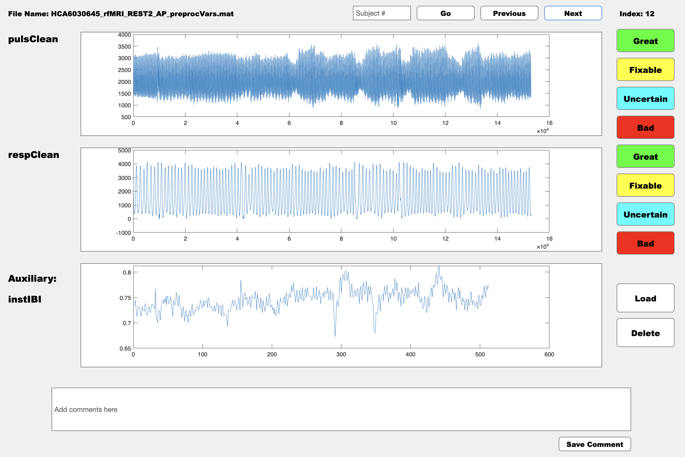

# Manual Annotation of Physiological Data Using MATLAB GUI

This guide will help you utilize the QA_app, a tool for visualizing and manually assessing the quality of physiological data in MATLAB. By following these instructions, you'll be able to label data quality, add comments, and generate a summary CSV file with your annotations.

## Getting Started

### Step 1: Download the MATLAB Application

**Download the application files**:

- **Clone the GitHub repository** containing the application. If you have Git installed, open your terminal or command prompt and run:
  ```bash
  git clone https://github.com/neurdylab/physio_QA_manual.git
  ```
- Alternatively, **download the ZIP file** from the GitHub page and extract it to your desired location.

### Step 2: Prepare Your Data

**Access example data files**:

- The repository includes a `Data` folder with four example `.mat` files. Each file represents a different subject with various physiological measures.

**Example folder structure**:
```
/physio_QA_manual
    /Data
        subject1.mat
        subject2.mat
        example1.mat
        example2.mat
        ...
```

### Step 3: Launch the Application

- **Open MATLAB** and set your current directory to the root of the `physio_QA_manual` folder.
- **Execute the `QA_App_v101.m` script** by typing the script's name in the Command Window and pressing Enter. This will open the Quality Assessment GUI.

### Step 4: Using the App

**Load Data**:

- Click on the `Load` button to populate the interface with fields from your `.mat` files.
- Enter the name of a physiological measure to display its data.

!!! note 
    You can load two physiological variables to QA simultaneously and an auxiliary waveform to aid your decision making process. 
   
**View and Assess Data**:

- Use the `Previous` and `Next` buttons to browse through different subjects.
- Rate each data segment's quality using categories like `Great`, `Good`, `Fixable`, or `Bad`.
   
**Add Comments**:
   
- Provide comments in the provided text box, especially if you mark data as `Fixable`. This helps in later reviews or corrections.

<figure markdown="span">
  { width="600" }
  <figcaption>Preview of the manual annotation tool.</figcaption>
</figure>

### Step 5: Save and Review Results

**Check and save your assessment results**:

- The app automatically saves your ratings and comments into a CSV file named based on your inputs during the initial setup.
- This file is stored in the root directory of the repository and can be referred to as `result.csv` or another name you provided.

!!! Warning "Important Notes"

    - You can close and reopen the app at any time; your assessments are saved continuously. **Do NOT** modify the structure of the CSV file or the Data folder after starting your assessments to avoid inconsistencies or data loss.

---

For further assistance or troubleshooting, feel free to open an [issue](https://github.com/neurdylab/physio_QA_manual/issues) on or github repo.